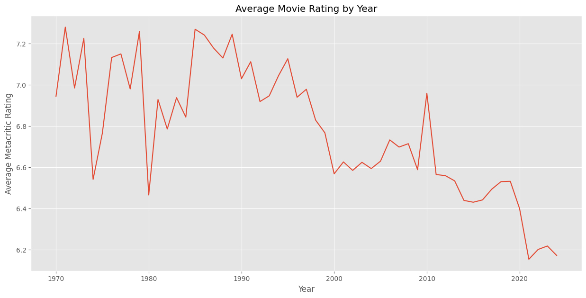

# Movie Data Analysis and Prediction

This project focuses on the analysis of a dataset containing 16,000 movies, as well as the development of predictive models for movie ratings and genres based on movie titles and descriptions. The project incorporates data cleaning, preprocessing, exploration, visualization, and machine learning models using Python libraries such as `pandas`, `numpy`, `scikit-learn`, `matplotlib`, `seaborn`, and `nltk`.



## Features

### 1. **Data Loading and Inspection**
- Load the movie dataset (`16k_Movies.csv`).
- Display and inspect the structure of the dataset.
- Output a summary of the dataset, including data types, missing values, and descriptions.

### 2. **Data Cleaning and Preprocessing**
- **Column Renaming**: Standardize column names by converting them to lowercase and replacing spaces with underscores.
- **Handling Missing Values**: Identify and remove missing values for key features like `duration`, `rating`, and `year`.
- **Data Type Conversion**: Convert string-based columns like `release_date`, `rating`, and `duration` to appropriate data types.
- **Feature Engineering**: 
  - Extract year from `release_date`.
  - Convert `duration` to hours.
  - Split genre, director, and writer columns into lists for better analysis.
  
### 3. **Exploratory Data Analysis (EDA)**
- Visualize trends like movie releases per year, the distribution of movie ratings, and the most common genres.
- Analyze the popularity of movie genres over time and identify top genres, directors, and writers.
- Explore relationships between movie duration and ratings.

### 4. **Outlier Detection and Removal**
- Detect and remove outliers in movie duration using the interquartile range (IQR) method.

### 5. **Visualization**
- **Movies Released Per Year**: Line plot showing the number of movies released each year.
- **Distribution of Movie Ratings**: Histogram with a kernel density estimate (KDE) to visualize rating distribution.
- **Top Genres**: Bar chart of the top 10 most common genres.
- **Duration vs. Rating**: Regression plot to examine the relationship between movie duration and ratings.

### 6. **Machine Learning Models**
- **Predictive Models**: Develop and train models to predict:
  - **Movie Rating** based on the combined title and description using a `Ridge` regression model.
  - **Movie Genres** using a `Logistic Regression` model with a multi-label classification approach.
  
#### a. **Preprocessing for Machine Learning**
- **Text Preprocessing**: Clean and preprocess movie titles and descriptions by:
  - Lowercasing the text
  - Removing URLs, mentions, hashtags, digits, and non-alphanumeric characters
  - Tokenizing, removing stopwords, and lemmatizing words
- **MultiLabelBinarizer**: Use `MultiLabelBinarizer` to transform the genre column into a format suitable for multi-label classification.

#### b. **Training and Evaluation**
- **Rating Prediction**:
  - Train a `Ridge` regression model to predict movie ratings.
  - Evaluate the model using metrics like Mean Squared Error (MSE) and R2 Score.
  
- **Genre Prediction**:
  - Train a `Logistic Regression` model with the `OneVsRestClassifier` to predict multiple genres for each movie.
  - Evaluate the model using metrics like F1 Score (micro/macro) and a classification report.

#### c. **Custom Inference**
- Provide a function to predict movie ratings and genres for custom movie titles and descriptions.

### 7. **Model Inference Examples**
- Real and fictional movie examples demonstrate the prediction capability for both movie ratings and genres.
  
## Requirements

To run this project, you’ll need the following libraries:

```bash
pip install pandas numpy scikit-learn matplotlib seaborn nltk joblib
```

## How to Use

1. Clone the repository:

```bash
git clone https://github.com/DaltonPayne/Movie-Data-Analysis-and-Prediction
cd movie-data-analysis-and-prediction
```

2. Ensure the dataset `16k_Movies.csv` is placed in the project folder.

3. Train the models by running the notebook called models.ipynb:

4. Predict ratings and genres for your movies or ideas:

```python

Real Movie Test:
Predicted Rating for 'The Godfather': 7.563060124019376
Predicted Genres for 'The Godfather': ['Drama']
Predicted Rating for 'Titanic': 7.646985307405162
Predicted Genres for 'Titanic': ['Drama', 'Romance']


Fake Movie Test:
Predicted Rating for 'Shadow Man': 6.340331114215586
Predicted Genres for 'Shadow Man': ['Thriller', 'Horror', 'Mystery']
Predicted Rating for 'Galactic Wars': 6.887879120924816
Predicted Genres for 'Galactic Wars': ['Action', 'Sci-Fi']
Predicted Rating for 'The Lost City of Andoria': 6.198276867857527
Predicted Genres for 'The Lost City of Andoria': ['Thriller', 'Adventure', 'Drama']
Predicted Rating for 'Cyber Revolution': 5.5109351360257195
Predicted Genres for 'Cyber Revolution': ['Sci-Fi', 'Drama', 'Action']
```

## Conclusion

This project combines movie data analysis and machine learning to provide insights into the movie industry and predict ratings and genres based on titles and descriptions.

Feel free to contribute or expand upon this project by adding more features or datasets!
